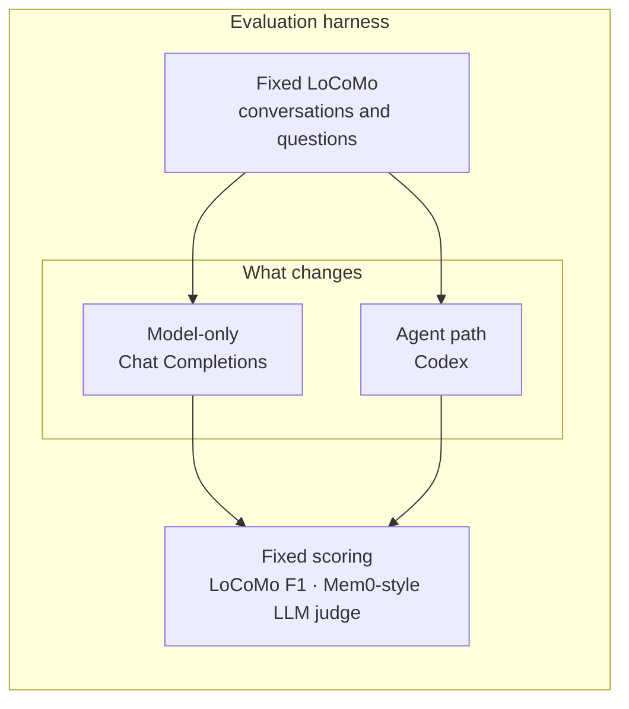

# Long-Term Memory Eval

Long-Term Memory Eval is a research pipeline for long-term conversational
memory on [LoCoMo](https://arxiv.org/abs/2402.17753). A controlled comparison
holds the dataset and the evaluation fixed and varies the memory system: the
memory representation the answerer receives, and whether that answerer is a
Chat Completions reader or Codex. Terms are in [docs/glossary.md](docs/glossary.md).

The model-only path sends the same rendered reader prompt to Chat Completions.
The agent path submits that task to Codex, with web and MCP tools disabled.
Both produce one answer per LoCoMo question. LoCoMo F1 and a separately run
Mem0-style LLM judge score those stored answers. Gold answers and evidence stay
with the scorer. They never enter a model or agent prompt.



*Figure: each condition selects its reader representation before the model or
agent answers. LoCoMo gold answers and evidence are available only to the
scorers; they are never included in a model or Codex task.*

## Quickstart

Local mock run. No API key.

```bash
conda create -n <your-env-name> python=3.11 -y
conda activate <your-env-name>
pip install -r requirements.txt
python scripts/fetch_locomo.py
python -m src.locomo_eval.run \
  --config configs/presets/mem0_baseline.yaml \
  --reader mock \
  --max-questions 5 \
  --run-id smoke_mock
```

The pack is written to `experiments/smoke_mock/`.

## Docs

- [**Glossary**](docs/glossary.md) - common terms used in the codebase
- [**Unrolling the experiment pipeline**](docs/loop.md) - one question, from config to notebook
- [**Architecture**](docs/architecture.md) - harness and experiment runner
- [**Installing, building, and running**](docs/runbook.md)
- [**Cloud Run**](docs/gcp.md) - details on the cloud infrastructure using GCP
- [**Reproduce**](docs/REPRODUCE.md) - staged local and Cloud Run reproduction
- [**Third-party terms**](NOTICE.md) - LoCoMo is CC BY-NC 4.0; Mem0 prompts are Apache-2.0

## License

This repository is licensed under the [MIT License](LICENSE). Copyright (c) 2026 Junsoo Park and Bryan Triana.

If you use this repository, cite the software. There is no paper for the harness itself. Machine-readable metadata is in [CITATION.cff](CITATION.cff).

```bibtex
@software{park2026longtermmemoryeval,
  author = {Park, Junsoo and Triana, Bryan},
  title = {Long-Term Memory Eval},
  year = {2026},
  url = {https://github.com/park-jsdev/long-term-memory-eval},
  license = {MIT}
}
```

Cite LoCoMo and Mem0 separately when you use those protocols:

```bibtex
@article{maharana2024evaluating,
  title={Evaluating very long-term conversational memory of LLM agents},
  author={Maharana, Adyasha and Lee, Dong-Ho and Tulyakov, Sergey and Bansal, Mohit and Barbieri, Francesco and Fang, Yuwei},
  journal={arXiv preprint arXiv:2402.17753},
  year={2024}
}
```

```bibtex
@article{chhikara2025mem0,
  title={Mem0: Building Production-Ready AI Agents with Scalable Long-Term Memory},
  author={Chhikara, Prateek and Khant, Dev and Aryan, Saket and Singh, Taranjeet and Yadav, Deshraj},
  journal={arXiv preprint arXiv:2504.19413},
  year={2025}
}
```
