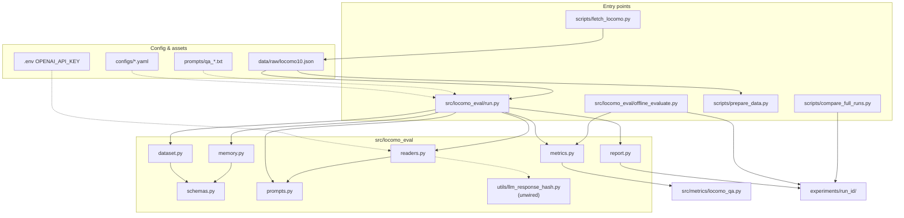
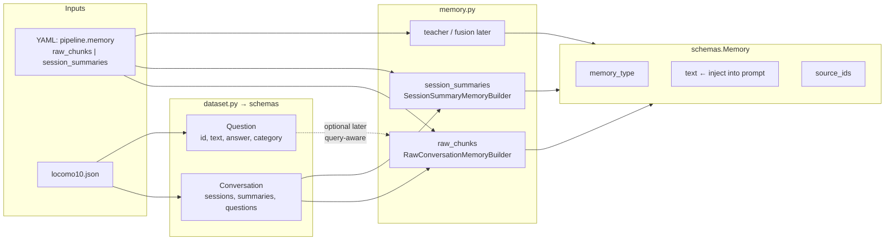
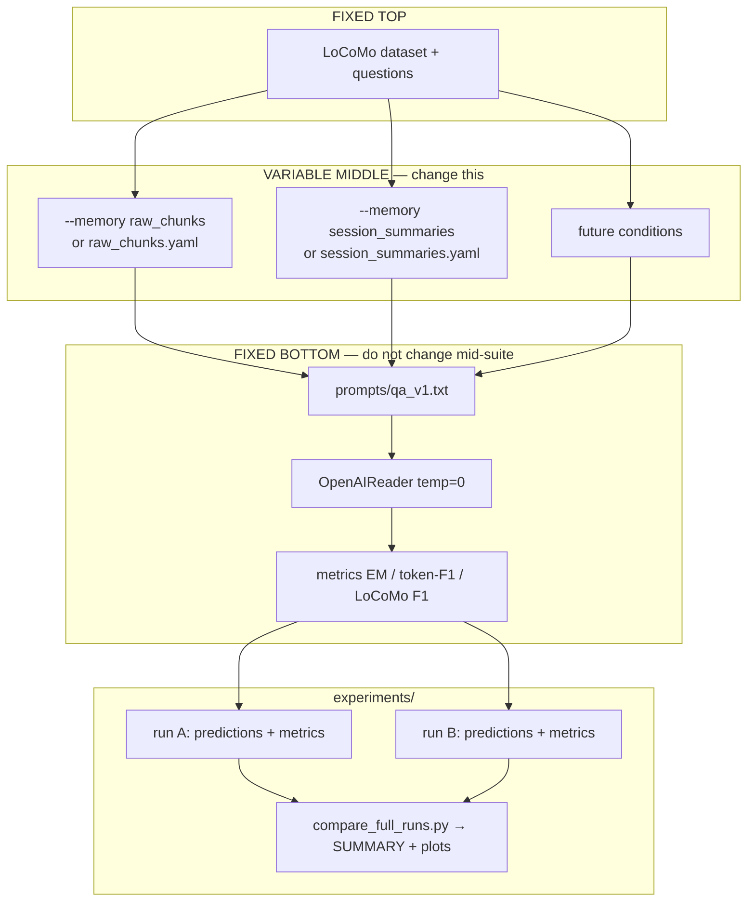
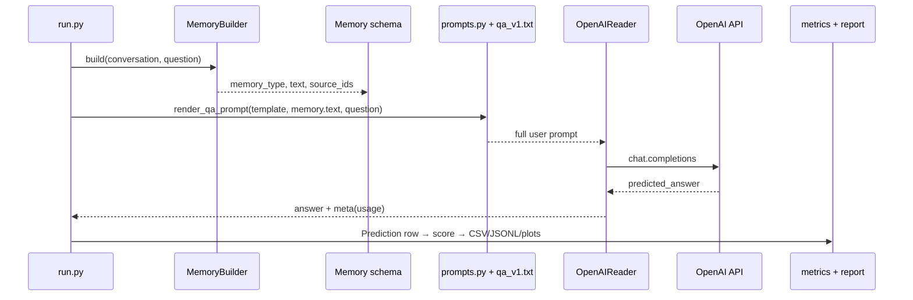

# LoCoMo multi-teacher memory research

conda + plain YAML + plain JSON + CSV/plots.  
**Now (v0.1):** sandwich **read path** with draft conditions **`raw_chunks`** (raw dialog) and **`session_summaries`**, fixed OpenAI answer model.  
**Later:** `teacher_session_summaries`, then `top1_teacher` / `whole_memory_aggregation` / `claim_fusion`. Maps: [`docs/reports/engineering_notebook.md`](docs/reports/engineering_notebook.md), [`docs/agent/HUMANS.md`](docs/agent/HUMANS.md).

---

## System diagrams

### 1. Architecture — files & components

How major packages relate. Solid arrows = call / data; dashed = configuration.



### 2. Memory path — configs, schema, I/O

Experimental **middle** = choose a `MemoryBuilder`. Everything else reads `Memory.text`.



| Condition | Config | Input from dataset | Output (`Memory.text`) |
|-----------|--------|--------------------|-------------------------|
| `raw_chunks` | `configs/raw_chunks.yaml` | session turns + dates | chronological raw dialog |
| `session_summaries` | `configs/session_summaries.yaml` | `session_summary` | concatenated session summaries |
| later | *(future)* | teachers / store | fused or selected memory string |

### 3. Evaluation experiment pipeline — changing conditions

**Sandwich:** freeze top (data) + bottom (prompt, model, metrics); vary only memory.



**Fair comparison recipe**

1. Same `prompt_path`, `reader.model`, `temperature`, `max_questions` / sample filter.  
2. Differ only `pipeline.memory` (or config file).  
3. Distinct `--run-id`s → then `scripts/compare_full_runs.py`.  
4. Sanity: `fraction_same_llm_request_hash ≈ 0` and different mean `memory_chars` in the compare report. That hash is a SHA-256 of the intended LLM request (not a live store lookup).

### 4. Memory + LLM lifecycle — builder, schema, prompts

Request path for one QA item. `LlmResponseHash` exists under `utils/` but is **not** used by `run.py` yet.



**What is frozen vs experimental in this lifecycle**

| Stage | Freeze for memory-condition tables? | Knob |
|-------|---------------------------|------|
| Builder → `Memory.text` | No | condition |
| Prompt template file | Yes (after lock) | `prompts/qa_*.txt` |
| Reader model / decode | Yes | `reader.*` in YAML |
| Store | Off (future optimization) | `utils/llm_response_hash.py`; pass to `get_reader` to re-enable |
| Metrics | Always | `metrics.py` / LoCoMo F1 |

---

## External APIs & models (living inventory)

Track every third-party API here so reviews and paper methods stay accurate.  
Update this section when you add Claude, Gemini, local HF, etc.

### Currently used

| Provider | Product | How we call it | Auth | Models in configs | Code entry |
|----------|---------|----------------|------|-------------------|------------|
| **OpenAI** | Platform API ([platform.openai.com](https://platform.openai.com)) | Official Python SDK `openai` ≥1.30 — **Chat Completions** (`client.chat.completions.create`) | `OPENAI_API_KEY` in repo-root `.env` (auto-loaded) | **Default:** `gpt-4.1-mini` · **Paper-style option:** `gpt-4.1` (set `reader.model`) | `src/locomo_eval/readers.py` → `OpenAIReader` |

| Decode defaults (frozen bottom unless re-locked) | Value |
|-----------------------------------------------------------------|-------|
| temperature | `0.0` |
| max_tokens (completion) | `64` |
| System message | `"You answer questions using only the provided memory."` |
| User message | rendered `prompts/qa_v1.txt` with `{memory}` + `{question}` |
| min_request_interval_s | `0.5` |
| max_retries on 429 | `8` (Retry-After / exponential backoff) |

**Not used yet:** Anthropic Claude, Google Gemini, Azure OpenAI, local Hugging Face generation, batch/Responses API, Assistants API.

### Commands that hit (or skip) OpenAI

| Command | API? | Notes |
|---------|------|--------|
| `python -m src.locomo_eval.run --config configs/raw_chunks.yaml ...` | Yes if `reader.provider: openai` | One Chat Completions call per unanswered QA (JSONL resume skips finished) |
| `... --reader mock` | No | Offline plumbing |
| `python -m src.locomo_eval.offline_evaluate --predictions ...` | No | String-metric rescore only (not an LLM autorater) |
| `python scripts/compare_full_runs.py ...` | No | Metrics / plots / cache-key *rehash* offline |
| `python scripts/prepare_data.py ...` | No | Local JSON → CSV/JSONL |
| `python scripts/fetch_locomo.py` | GitHub raw HTTP | Dataset file only, not OpenAI |

### Config knobs

```yaml
# configs/raw_chunks.yaml, session_summaries.yaml, baseline.yaml
reader:
  provider: openai          # or mock
  model: gpt-4.1-mini       # override: --model gpt-4.1
  temperature: 0.0
  max_tokens: 64
  max_retries: 8
  min_request_interval_s: 0.5
  max_wait_s: 3600
```

CLI overrides:

```bash
python -m src.locomo_eval.run --config configs/session_summaries.yaml \
  --model gpt-4.1 --max-questions 20 --run-id cmp_session_summaries_gpt41_n20
```

### Cost & quota considerations

| Topic | Detail |
|-------|--------|
| Billing unit | 1 Chat Completions request per unanswered question (JSONL resume skips finished Qs) |
| Full LoCoMo | ~1986 Qs per condition → ~1986 requests if starting cold |
| Free/low tier | Can hit **RPD ~50/day** → use `max_questions`, resume same `--run-id` |
| Prompt size | `raw_chunks` can be ~tens of k chars (truncated by `memory_max_chars`); drives **input tokens** not request count |
| LLM response hash | Implemented in `utils/llm_response_hash.py`, **not wired**. Re-enable later via `get_reader(..., llm_response_hash=...)` |
| Raising limits | [Billing](https://platform.openai.com/account/billing) + [Rate limits](https://platform.openai.com/account/rate-limits) |

### Planned swaps (not wired)

| Role | Candidate | Why later |
|------|-----------|-----------|
| Fixed answer LLM | Claude (Anthropic API) | User preference for eval-phase; keep same prompt freeze rules |
| Teachers (write path) | GPT / Gemini / DeepSeek | Multi-teacher middle layer only |

When Claude is added: new `reader.provider: anthropic`, document model IDs and env var (`ANTHROPIC_API_KEY`) in this same section.

---

## Setup

```bash
conda create -n distillation python=3.11 -y
conda activate distillation
pip install -r requirements.txt
python scripts/fetch_locomo.py
```

For live runs, copy `.env.example` → `.env` and set `OPENAI_API_KEY` (gitignored; auto-loaded).

## OpenAI rate limits

See **External APIs & models** above for the authoritative inventory. Short form: low-tier Orgs may see **~50 RPD** for `gpt-4.1-mini`; full eval needs higher limits or multi-day resume.
---

## Phase 1 — raw_chunks vs session_summaries (frozen reader/prompt, vary memory)

See [`docs/reports/engineering_notebook.md`](docs/reports/engineering_notebook.md).

```bash
# Offline: both conditions mockable
python -m src.locomo_eval.run --config configs/raw_chunks.yaml --reader mock --max-questions 5 --run-id smoke_raw_chunks
python -m src.locomo_eval.run --config configs/session_summaries.yaml --reader mock --max-questions 5 --run-id smoke_session_summaries

# Live (same model/prompt; n=20 for a cheap comparison)
python -m src.locomo_eval.run --config configs/raw_chunks.yaml --max-questions 20 --run-id cmp_raw_chunks_n20
python -m src.locomo_eval.run --config configs/session_summaries.yaml --max-questions 20 --run-id cmp_session_summaries_n20
python scripts/compare_full_runs.py --runs experiments/cmp_raw_chunks_n20 experiments/cmp_session_summaries_n20 --out experiments/compare_raw_chunks_session_summaries
```

Outputs under `experiments/<run_id>/`: `predictions.csv`, `metrics.json`, `plots/`, `run_meta.json`, and **`memory/`** (exact `{memory}` texts + schema — see [`docs/schemas/memory_runtime.md`](docs/schemas/memory_runtime.md)).  
Compare also writes `SUMMARY.md`, `paired_questions.csv`, and cache/memory sanity plots under `experiments/compare_raw_chunks_session_summaries/`.

Flatten the dataset for inspection:

```bash
python scripts/prepare_data.py --split all --no-jsonl   # data/processed/qa_all.csv
```

Rescore with string metrics only (no API, not an LLM autorater):

```bash
python -m src.locomo_eval.offline_evaluate --predictions experiments/<run_id>/predictions.jsonl
```

Tests:

```bash
python -m unittest tests/test_evaluation_pipeline.py -q
```

## Layout

```text
configs/                  # baseline, raw_chunks, session_summaries
prompts/qa_v1.txt
src/locomo_eval/          # run, memory, memory_log, readers, metrics, report
docs/schemas/             # memory_runtime.md + memory_io.schema.json
src/metrics/locomo_qa.py  # official LoCoMo F1
scripts/                  # fetch, prepare_data, compare_full_runs
docs/reports/             # engineering_notebook
docs/agent/               # SPEC, AGENTS, HUMANS, traces
docs/reflections/         # version audit writeups
experiments/<run_id>/     # audit pack
data/raw/locomo10.json    # fetched, gitignored
data/processed/qa_all.csv # flattened QA (no full context)
```

## Docs for humans and agents

- Humans: [`docs/agent/HUMANS.md`](docs/agent/HUMANS.md)
- Agents: [`docs/agent/AGENTS.md`](docs/agent/AGENTS.md)
- Engineering notebook: [`docs/reports/engineering_notebook.md`](docs/reports/engineering_notebook.md)
- Spec: [`docs/agent/SPEC_v1.md`](docs/agent/SPEC_v1.md)
- Runtime memory schema / logs: [`docs/schemas/memory_runtime.md`](docs/schemas/memory_runtime.md)
- History: [`docs/agent/traces/`](docs/agent/traces/)
- Reflections: [`docs/reflections/`](docs/reflections/)

## Citation

```bibtex
@article{maharana2024evaluating,
  title={Evaluating very long-term conversational memory of llm agents},
  author={Maharana, Adyasha and Lee, Dong-Ho and Tulyakov, Sergey and Bansal, Mohit and Barbieri, Francesco and Fang, Yuwei},
  journal={arXiv preprint arXiv:2402.17753},
  year={2024}
}
```
