# memorybench — LoCoMo long-term memory research harness

Research pipeline for **long-term conversational memory** on [LoCoMo](https://github.com/snap-research/locomo).
Local clones of the Mem0-paper methods (`full_context`, `rag`, `openai_memory`, `mem0`, `mem0g`) plus a
**multi-teacher write path** (`teacher_session_summaries`, `teacher_graph`, pooled and fused variants),
all evaluated under one frozen answer model and one frozen judge.

Plain YAML, plain JSON, Parquet, CSV, matplotlib. No Hydra, no W&B, no database.

> **Claim discipline.** This is an architecture clone, not a reproduction of Mem0 Platform numbers.
> Do **not** claim paper Table 1–2 `J` from these OSS clones. The mock autorater is a plumbing check
> (`mock_sanity_not_llm_judge`) and never occupies a literature column.

---

## Contents

| Section | What it answers |
|---|---|
| [Framework](#framework) | The seven layers and their one-line contracts |
| [Architecture](#architecture) | How the layers connect |
| [Layer detail](#layer-detail) | Sub-diagrams per layer |
| [Campaign and experiment lifecycle](#campaign-and-experiment-lifecycle) | YAML to published tables |
| [Staged job pipeline](#staged-job-pipeline) | The four waves and their LLM calls |
| [LLM call inventory](#llm-call-inventory) | Every API call and its role |
| [Analysis](#analysis-online-vs-offline) | Online judge vs offline reporting |
| [Verification](#verification-deterministic-tests) | Unit, sanity, regression, integration tests |
| [Planes](#control-data-and-observability-planes) | Control, data, observability |
| [Setup](#setup) | Install and dataset |
| [Reproduce](#reproduce) | Pointer to the runbook |

---

## Framework

The repo is deliberately split so that **what you want to measure** is data, and
**how it gets measured** is code that never changes per experiment.

| Layer | Contract | Lives in |
|---|---|---|
| **Recipe** | Declarative YAML. Names models, memory methods, groupings, metrics, plot kinds. Carries no logic. | `configs/` |
| **Engine** | Shared deterministic scripts. Same input always produces the same table and figure. Never forked per campaign. | `scripts/analysis/`, `src/locomo_eval/`, `src/metrics/` |
| **Experiment** | One sandwich claim: fixed top and bottom, exactly one varying middle. Declares its own validation. | `configs/experiments/*.yaml` |
| **Campaign** | An ordered set of experiments sharing a freeze note and cross-experiment analyses. | `configs/analysis/*.yaml` |
| **Job** | One execution of one matrix cell, or one collector pass. Idempotent, hash-identified, resumable. | `src/memorybench/` |
| **Audit log** | Per-run observability snapshot: inputs, prompts, memory, traces, lineage, cost, git hash. | `experiments/<run_id>/` |
| **Test** | Deterministic verifier. Locks the contracts above so a refactor cannot silently change a claim. | `tests/` |

The load-bearing rule: **a new experiment or campaign is a new YAML file, never new plotting code.**

---

## Architecture

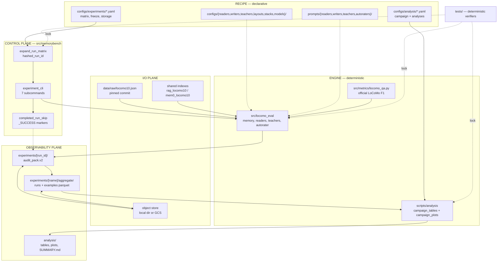

---

## Layer detail

### 1. Recipe layer — `configs/`

Every config file is standalone and composed with `includes:` (deep-merge, later keys win,
**lists replace rather than concatenate**). Implementation: `src/config.py`.

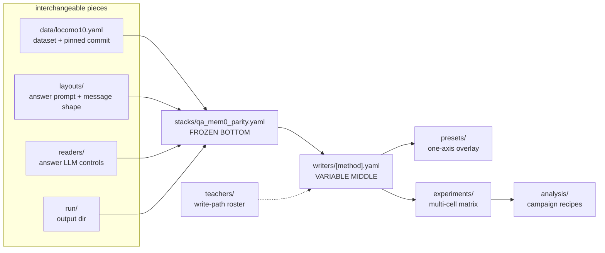

| Directory | Role | Key YAML keys |
|---|---|---|
| `configs/data/` | Dataset pin | `data.raw_path`, `data.locomo_commit` |
| `configs/layouts/` | Answer prompt and Chat Completions message shape | `pipeline.prompt_path`, `reader.message_layout` |
| `configs/readers/` | Answer LLM request controls | `reader.provider`, `reader.model`, `reader.temperature` |
| `configs/stacks/` | Frozen bottom of the sandwich | `includes:` of data + layout + reader + run |
| `configs/writers/` | The variable middle: memory method | `pipeline.memory`, plus `rag.*` / `mem0.*` / `orchestrator.*` |
| `configs/teachers/` | Write-path teacher roster | `teachers[]`, `teacher.prompt_path`, `teacher.thinking` |
| `configs/autoraters/` | Judge config, separate from QA | `autorater.provider`, `autorater.model`, `autorater.skip_category` |
| `configs/models/` | Pinned model identities | `models.<id>.api_model_id`, `model_snapshot`, `status` |
| `configs/experiments/` | Memorybench matrices | `experiment`, `matrix`, `judge`, `subset`, `storage`, `shared_indexes` |
| `configs/analysis/` | Campaign and experiment report recipes | `campaign`, `defaults`, `campaign_analyses`, `experiments` |
| `configs/presets/` | Single-axis overlays for `locomo_eval.run` | `includes:` writer + reader |

**Model pinning.** `configs/models/generation_catalog.yaml` holds `api_model_id` (what is sent) and
`model_snapshot` (the dated identity that makes a live cell reproducible). A model carrying
`status: to_confirm` marks its cells `to_confirm`, and `execute-qa` refuses them unless you pass
`--allow-unconfirmed`.

### 2. Engine layer — deterministic scripts

Engines are pure functions over finished artifacts. They are the only place charts and tables exist.

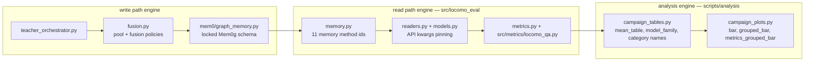

Invariants the engine layer owns, so no recipe has to restate them:

- **Legend placement.** Always outside the axes; it cannot cover bars.
- **Category naming.** `question_category` renders as `1 multi-hop`, `2 temporal`, `3 open-domain`,
  `4 single-hop`, `5 adversarial` — the official LoCoMo JSON ids from `CATEGORY_NAMES`, *not* the
  paper §4.1 prose numbering.
- **Family colors.** OpenAI, Anthropic, DeepSeek get stable colors derived from `reader_provider`
  or `writer_model`.
- **Deterministic ordering.** Categories sort by numeric id; row order in the source Parquet does
  not change a CSV or a PNG.

### 3. Experiment layer — the sandwich

Each experiment is one claim. Fix the top and bottom, vary exactly one middle.

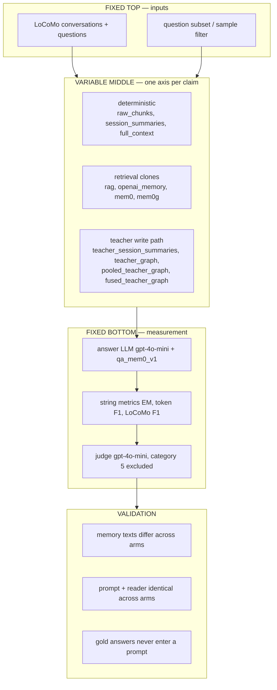

| `experiment.type` | Meaning |
|---|---|
| `sweep` | Cartesian matrix; readers may vary |
| `sandwich` | Requires `experiment.freeze.reader`; rejects a multi-entry reader axis |
| `ablation` | Remove or degrade one write-path component |
| `calibration` | Plumbing and cost calibration cells |

Matrix axes expand in fixed order `reader → memory_method → writer → seed`. Combinations are dropped
when a `writer` is supplied to a non-teacher memory method, or omitted from a teacher method.

### 4. Campaign layer

A campaign is an ordered set of experiments plus the analyses that span them.

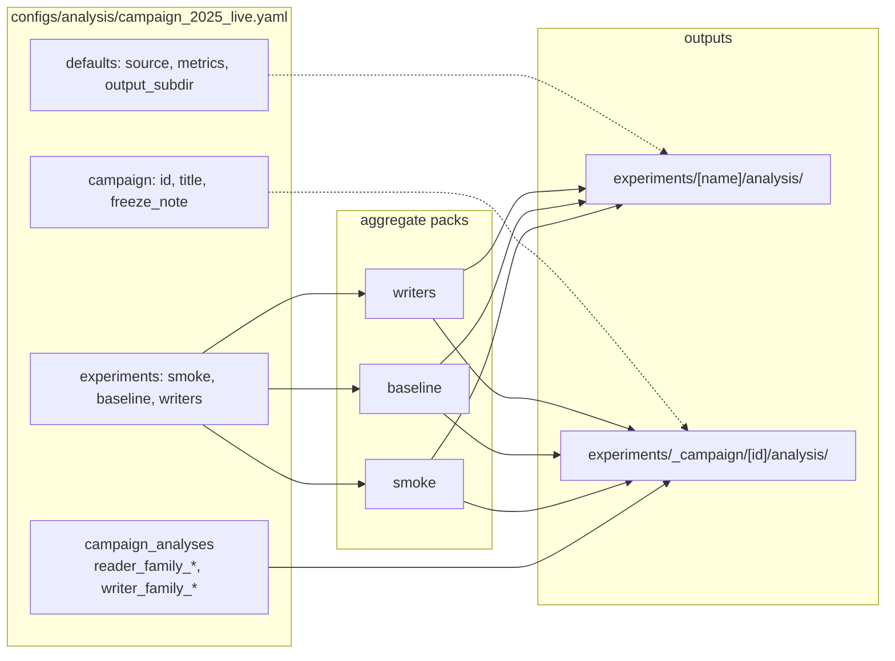

Each analysis entry names a table and its figures:

```yaml
- id: reader_family_by_category
  experiments: [smoke, baseline]
  group_by: [model_family, question_category]
  metrics: [locomo_f1, judge_score]
  plots:
    - kind: grouped_bar
      x: question_category
      hue: model_family
      y: locomo_f1
```

Missing packs are **skipped and reported**, never fatal, so a campaign notebook runs before every
experiment has landed. `family_from: reader | writer` decides whether `model_family` is derived from
the answer model or the write model — a reader sweep and a writer sweep must not be mixed into one
family analysis.

---

## Campaign and experiment lifecycle

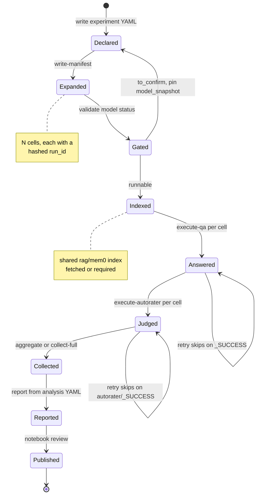

Two properties make this safe to interrupt:

1. **Hashed identity.** A `run_id` is `<experiment-slug>-<8 hex>`, hashed over the QA identity
   (benchmark, experiment name, memory method, reader provider and model, writer model, prompt path,
   subset caps, sample id, seed, shared index ids). Change a knob that matters and you get a new
   directory; change the judge model and you do not.
2. **Idempotent stages.** Each stage writes `_SUCCESS` last. A retry skips completed cells unless
   `--force`. Within a stage a run is *replace-not-append*: it clears its own generated output and
   regenerates from question one. `predictions.jsonl` is an audit artifact, not a checkpoint.

---

## Staged job pipeline

Stages run as **sequential waves**; cells **within** a wave are parallel.

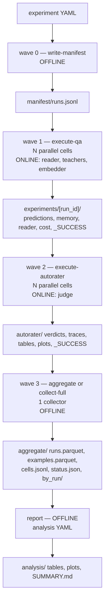

| Wave | Command | API? | Writes | Parallelism |
|---|---|---|---|---|
| 0 | `write-manifest <exp.yaml>` | No | `manifest/runs.jsonl` | single |
| 1 | `execute-qa <exp.yaml> --run-index i` | **Yes** — reader, plus teachers and embedders when the method needs them | run pack + `_SUCCESS` | one task per cell |
| 2 | `execute-autorater <exp.yaml> --run-index i` | **Yes** — judge only | `autorater/` + `autorater/_SUCCESS` | one task per cell |
| 3 | `aggregate` / `collect-full <exp.yaml>` | No | `aggregate/` or `collected/` | single collector |
| — | `report <analysis.yaml>` | No | `analysis/` | single |
| — | `status <exp.yaml>` | No | stdout counts | single |

On Cloud Run the cell index comes from `CLOUD_RUN_TASK_INDEX`; locally it comes from `--run-index`.
Wave 2 **fail-fasts** if a cell has no QA `_SUCCESS`, so a judge can never score a partial answer set.
`aggregate` writes the thin catalog used by analysis; `collect-full` additionally copies `memory/`
dumps for deep audit.

### Stage detail: what happens inside `execute-qa`

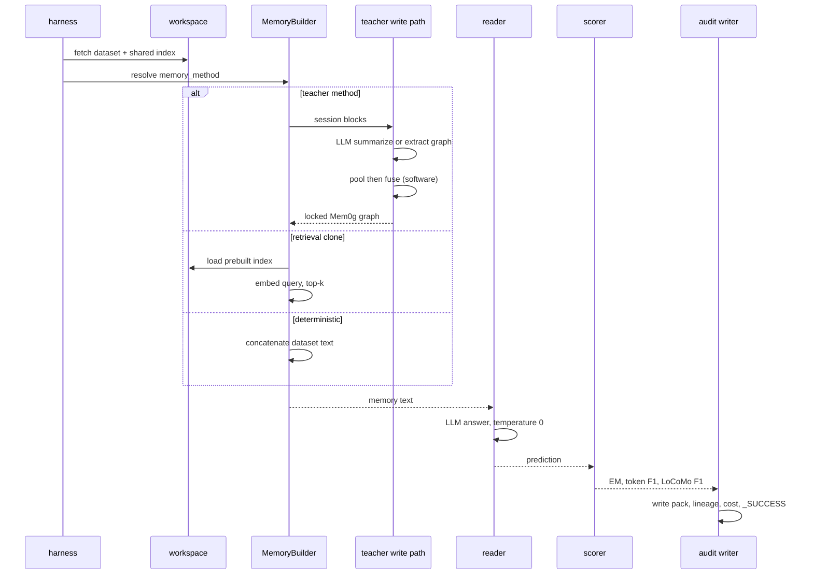

---

## LLM call inventory

Every external call, and the role it plays. The **write path** builds memory; the **read path**
answers; the **judge** scores. Only the read path and judge are frozen for a memory claim.

| Role | Path | Module | Prompt | Providers |
|---|---|---|---|---|
| Answer / reader | read | `readers.py` | `prompts/readers/qa_mem0_v1.txt` | openai, deepseek, anthropic, mock |
| Teacher session summary | write | `teachers.py` | `prompts/teachers/teacher_session_v1.txt` | openai, anthropic, deepseek, mock |
| Teacher graph extraction | write | `teachers.py` | `prompts/teachers/teacher_graph_v1.txt` | openai, anthropic, deepseek, mock |
| Mem0 fact extract | write index | `mem0/extract.py` | `prompts/writers/mem0_extract_v1.txt` | openai, mock |
| Mem0 update ADD/UPDATE/DELETE/NONE | write index | `mem0/update.py` | `prompts/writers/mem0_update_v1.txt` | openai, mock |
| Mem0g entities | write index | `mem0/graph_memory.py` | `prompts/writers/mem0g_entities_v1.txt` | openai, mock |
| Mem0g relations | write index | `mem0/graph_memory.py` | `prompts/writers/mem0g_relations_v1.txt` | openai, mock |
| Mem0g conflict | write index | `mem0/graph_memory.py` | `prompts/writers/mem0g_conflict_v1.txt` | openai, mock |
| OpenAI-memory extract-all | write index | `openai_memory/extract.py` | `prompts/writers/openai_memory_extract_v1.txt` | openai, mock |
| Embedding, index and query | both | `mem0/embeddings.py` | none | openai `text-embedding-3-small`, mock |
| Autorater / judge | score | `autorater.py` | `prompts/autoraters/autorater_mem0_v1.txt` | openai, mock |

**Not LLM calls:** pooling and fusion (`fusion.py`), the orchestrator, preprocessing, the
deterministic builders, every metric, and every analysis script. Fusion is software, not one large
prompt.

**Request-shape pinning** lives in `models.py`, because provider APIs drift:

- Hosted `gpt-5` rejects `reasoning_effort=none`, so it is pinned to `minimal`; GPT-5.6 keeps `none`.
- Anthropic SDK 1.0 removed `temperature` from `messages.create`, so it moves into `extra_body`.
- Teacher *thinking* is a write-path knob. The frozen reader never gains reasoning effort from it.

Every memory method, and whether it spends tokens at QA time:

| Memory method | Write-path LLM | Read-path LLM | Notes |
|---|---|---|---|
| `raw_chunks` | none | none | chronological dialog |
| `session_summaries` | none | none | dataset-provided summaries |
| `full_context` | none | none | entire timestamped transcript |
| `rag` | index built earlier | query embedding | Mem0-paper clone: 256-token chunks, k=2 |
| `openai_memory` | index built earlier | none | privileged extract-all protocol clone |
| `mem0` | index built earlier | query embedding | vector store |
| `mem0g` | index built earlier | query embedding | vector + graph |
| `teacher_session_summaries` | **per session** | none | one teacher summarizes |
| `teacher_graph` | **per session** | node embedding | single teacher to locked graph |
| `pooled_teacher_graph` | **per session × K** | node embedding | naive pool |
| `fused_teacher_graph` | **per session × K** | node embedding | majority vote or slot resolve |

Pool policies: `single`, `round_robin`, `random`, `equal_weight`.
Fusion policies: `none`, `majority_vote`, `resolve_top_voted`, `resolve_first`, `resolve_random`,
`resolve_round_robin`, `resolve_confidence`. The `resolve_*` family is a baseline heuristic set;
claim-level fusion and LLM validators are future work.

---

## Analysis: online vs offline

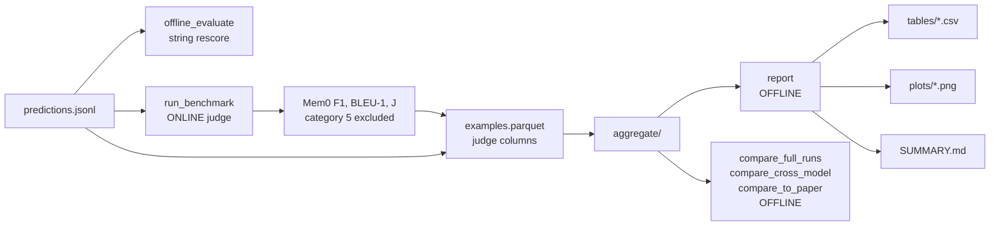

**Exactly one analysis step costs money:** `scripts/analysis/run_benchmark.py` with a live judge.
Everything else — rescoring, aggregation, campaign reports, paired comparisons, paper comparisons,
seed aggregation — reads finished artifacts and never touches an API.

Metrics are **dual-reported and separately labelled**: the SPEC metrics (`exact_match`, `token_f1`)
and the official LoCoMo category F1 always; Mem0 lexical F1, BLEU-1 and judged `J` only in autorater
reports, with category 5 excluded from `J`.

Autorater packs are **snapshots**: every invocation clears the generated verdicts, tables, plots and
metadata, then regenerates from one prediction file. Analyses are never appended.

---

## Verification: deterministic tests

`tests/` is the verifier layer. Every test is `unittest`-style, **mock-only, offline, no API key**.
Optional skips cover a missing dataset file, missing matplotlib, or missing pyarrow.

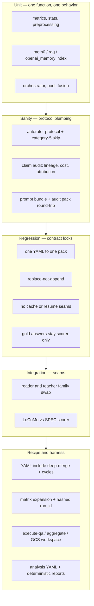

| Group | Files | Locks |
|---|---|---|
| Unit | `test_preprocessing_pipeline`, `test_session_documents`, `test_preprocess_index`, `test_stats`, `test_evaluation_pipeline`, `test_mem0_index`, `test_rag_index`, `test_openai_memory`, `test_teacher_orchestrator`, `test_compare_to_paper` | Scoring, indexing, pooling, fusion behave as specified |
| Sanity | `test_autorater_sanity`, `test_claim_audit`, `test_experiment_pack`, `test_prompt_bundle` | Judge protocol, lineage and cost audit, pack round-trip |
| Regression | `test_regressions`, `test_run_isolation` | Sandwich contracts, no hidden caching, gold never in a prompt |
| Integration | `test_integration_sanity` | Model-swap seams stay pluggable |
| Recipe / harness | `test_config_includes`, `test_memorybench_matrix`, `test_memorybench_execute_qa`, `test_memorybench_aggregate`, `test_gcs_run_workspace`, `test_analysis_campaign` | Merge semantics, hashed ids, staged pipeline, deterministic reports |

The analysis verifiers are worth calling out, because they are what keep the recipe/engine split
honest: every campaign analysis must reference a configured experiment; every plot `x`, `hue` and `y`
must exist in that analysis's `group_by` or `metrics`; analysis ids must be unique per output
directory; notebooks must stay thin YAML wrappers with no plotting code; and re-running a report over
reordered input rows must produce **byte-identical** CSV and PNG files.

```bash
# Analysis plane only
python -m pytest tests/test_analysis_campaign.py -q

# Harness subset
make test

# Full suite (mock only, no API key) — see docs/agent/AGENTS.md for the pinned list
python -m pytest tests/ -q
```

`pytest.ini` sets `-p no:asyncio`: these are plain `unittest.TestCase` classes, and an installed
`pytest-asyncio` breaks collection under pytest 9. With `unittest`, use the **file-path** form
(`python -m unittest tests/test_x.py`) so a site-packages module named `tests` cannot shadow this
folder.

---

## Control, data, and observability planes

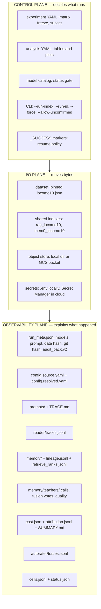

### Snapshot trail for one answer

Any number in a published table can be walked back to the bytes that produced it.

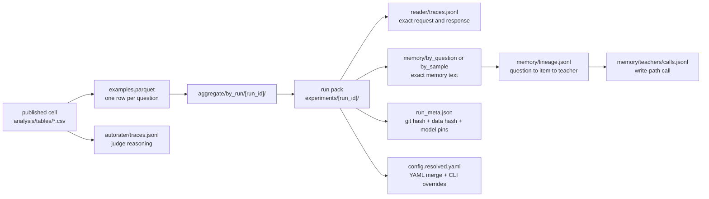

Each run pack (`audit_pack.v2`) always contains predictions in JSONL and CSV, `metrics.json` and
`metrics_by_category.csv`, `run_meta.json`, both frozen config files, `cost.json`, `SUMMARY.md`,
`ATTRIBUTION.md` with `attribution.jsonl`, `TRACE.md`, `plots/`, `reader/`, `prompts/`, and `memory/`.
Teacher conditions add `memory/teachers/` (calls, session text, fusion votes, `quality.json`); graph
conditions add `memory/graph/` including `ingest.jsonl` recorded after fusion. Retrieval conditions
record losers as well as winners in `retrieve_ranks.jsonl`, so a retrieval claim is auditable rather
than asserted.

---

## Setup

```bash
conda create -n distillation python=3.11 -y
conda activate distillation
pip install -r requirements.txt
python scripts/fetch_locomo.py
```

Copy `.env.example` to `.env` and set what you need: `OPENAI_API_KEY`, `ANTHROPIC_API_KEY`,
`DEEPSEEK_API_KEY`. The file is gitignored and auto-loaded. **Never commit keys.** In Cloud Run the
same values come from Secret Manager.

Offline smoke, no key required:

```bash
python -m src.locomo_eval.run --config configs/presets/mem0_baseline.yaml \
  --reader mock --max-questions 5 --run-id smoke_mock
```

## Repository layout

```text
configs/            recipes: data, layouts, readers, writers, teachers,
                    autoraters, stacks, presets, models, experiments, analysis
prompts/            readers/, writers/, teachers/, autoraters/
src/locomo_eval/    read + write path engine, audit pack writer
src/memorybench/    control plane: matrix, jobs, storage, aggregation
src/metrics/        official LoCoMo category F1
scripts/            fetch, prepare, deploy, compare
scripts/analysis/   campaign_tables, campaign_plots, run_benchmark, comparisons
notebooks/          thin YAML wrappers, local by default (gitignored)
tests/              deterministic verifiers, mock only
infra/gcp/          resource inventory + bootstrap
docs/               schemas, runbooks, methodology reports
experiments/        run packs, aggregates, reports (gitignored)
data/raw/           locomo10.json (fetched, gitignored)
```

## Reproduce

Step-by-step reproduction, local and Cloud Run: **[`docs/REPRODUCE.md`](docs/REPRODUCE.md)**.

| Document | Audience |
|---|---|
| [`docs/REPRODUCE.md`](docs/REPRODUCE.md) | Reproduce the published campaign end to end |
| [`docs/agent/RUNBOOK_2025_LIVE.md`](docs/agent/RUNBOOK_2025_LIVE.md) | Operator detail for the live 2025 campaign |
| [`docs/agent/GCP_RUNBOOK.md`](docs/agent/GCP_RUNBOOK.md) | One-time GCP bootstrap |
| [`docs/agent/AGENTS.md`](docs/agent/AGENTS.md) | Coding-agent operating notes |
| [`docs/schemas/`](docs/schemas/) | On-disk contracts: audit pack, analysis campaign, indexes |
| [`docs/reports/engineering_notebook.md`](docs/reports/engineering_notebook.md) | System map, freeze and extend rules |
| [`docs/reports/multi_teacher_methodologies.md`](docs/reports/multi_teacher_methodologies.md) | Teacher, pooling, and fusion methodology |
| [`configs/README.md`](configs/README.md) | The `includes:` compose mechanism |
| [`NOTICE.md`](NOTICE.md) | Dataset and third-party prompt terms |

## Citation

Dataset and evaluator:

```bibtex
@article{maharana2024evaluating,
  title={Evaluating very long-term conversational memory of LLM agents},
  author={Maharana, Adyasha and Lee, Dong-Ho and Tulyakov, Sergey and Bansal, Mohit and Barbieri, Francesco and Fang, Yuwei},
  journal={arXiv preprint arXiv:2402.17753},
  year={2024}
}
```

Memory protocol, judge prompt, and literature baselines:

```bibtex
@article{chhikara2025mem0,
  title={Mem0: Building Production-Ready AI Agents with Scalable Long-Term Memory},
  author={Chhikara, Prateek and Khant, Dev and Aryan, Saket and Singh, Taranjeet and Yadav, Deshraj},
  journal={arXiv preprint arXiv:2504.19413},
  year={2025}
}
```

LoCoMo pin: `3eb6f2c585f5e1699204e3c3bdf7adc5c28cb376`.
Mem0 prompt pins: `ece7ff6b` (extract, update, judge), `69a832dc` (graph).
