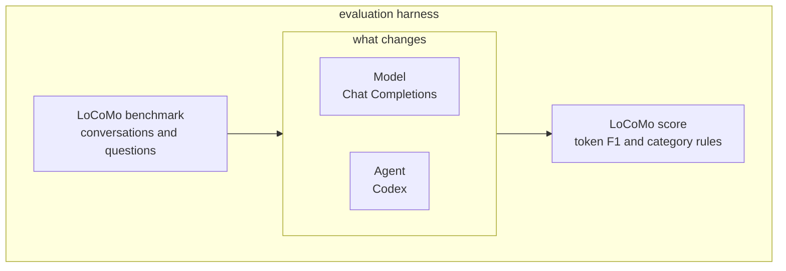

# Long-Term Memory Eval

Evaluation harness for long-term conversational memory. It runs the [LoCoMo](https://arxiv.org/abs/2402.17753) benchmark. A **model** answers through Chat Completions, or writes memory and then a frozen reader answers. An **agent** (Codex) answers from the conversation files in a workspace. LoCoMo scores the prediction. This repository did not author LoCoMo or the Mem0 judge.

The data and the scorer stay fixed. The memory method in the middle is what changes. Gold answers stay with the scorer. They never enter a model or agent prompt.



The Mem0 judge is a second protocol on the same predicted string. Do not report Mem0 paper Table 1–2 `J` from these clones. A mock judge is a plumbing check and is not a literature score.

## Quickstart

Local mock run. No API key.

```bash
conda create -n distillation python=3.11 -y
conda activate distillation
pip install -r requirements.txt
python scripts/fetch_locomo.py
python -m src.locomo_eval.run \
  --config configs/presets/mem0_baseline.yaml \
  --reader mock \
  --max-questions 5 \
  --run-id smoke_mock
```

The pack is written to `experiments/smoke_mock/`.

## Docs

- [**Documentation**](docs/documentation.md) — architecture, including the experiment runner
- [**Installing, building, and running**](docs/runbook.md)
- [**Cloud Run**](docs/gcp.md)
- [**Reproduce**](docs/REPRODUCE.md) — staged local and Cloud Run reproduction
- [**Third-party terms**](NOTICE.md) — LoCoMo is CC BY-NC 4.0; Mem0 prompts are Apache-2.0

## License

This repository is licensed under the [MIT License](LICENSE). Copyright (c) 2026 Junsoo Park and Bryan Triana.

If you use this repository, cite the software. There is no paper for the harness itself. Machine-readable metadata is in [CITATION.cff](CITATION.cff).

```bibtex
@software{park2026longtermmemoryeval,
  author = {Park, Junsoo and Triana, Bryan},
  title = {Long-Term Memory Eval},
  year = {2026},
  url = {https://github.com/park-jsdev/long-term-memory-eval},
  license = {MIT}
}
```

Cite LoCoMo and Mem0 separately when you use those protocols:

```bibtex
@article{maharana2024evaluating,
  title={Evaluating very long-term conversational memory of LLM agents},
  author={Maharana, Adyasha and Lee, Dong-Ho and Tulyakov, Sergey and Bansal, Mohit and Barbieri, Francesco and Fang, Yuwei},
  journal={arXiv preprint arXiv:2402.17753},
  year={2024}
}
```

```bibtex
@article{chhikara2025mem0,
  title={Mem0: Building Production-Ready AI Agents with Scalable Long-Term Memory},
  author={Chhikara, Prateek and Khant, Dev and Aryan, Saket and Singh, Taranjeet and Yadav, Deshraj},
  journal={arXiv preprint arXiv:2504.19413},
  year={2025}
}
```
