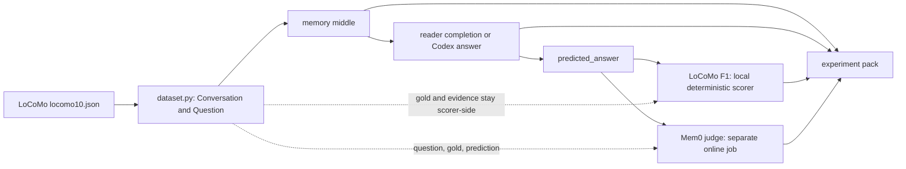
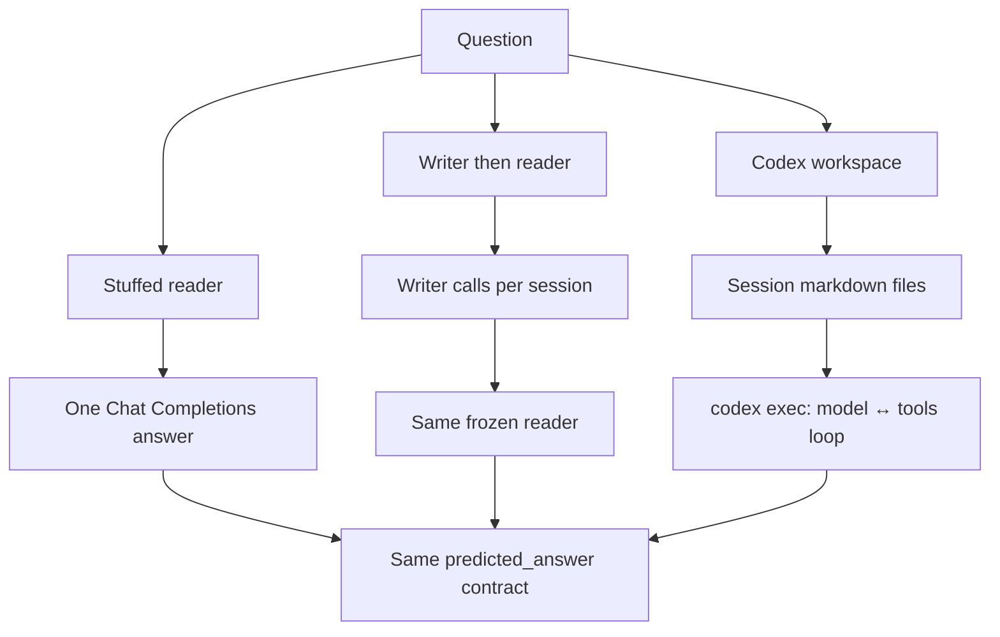
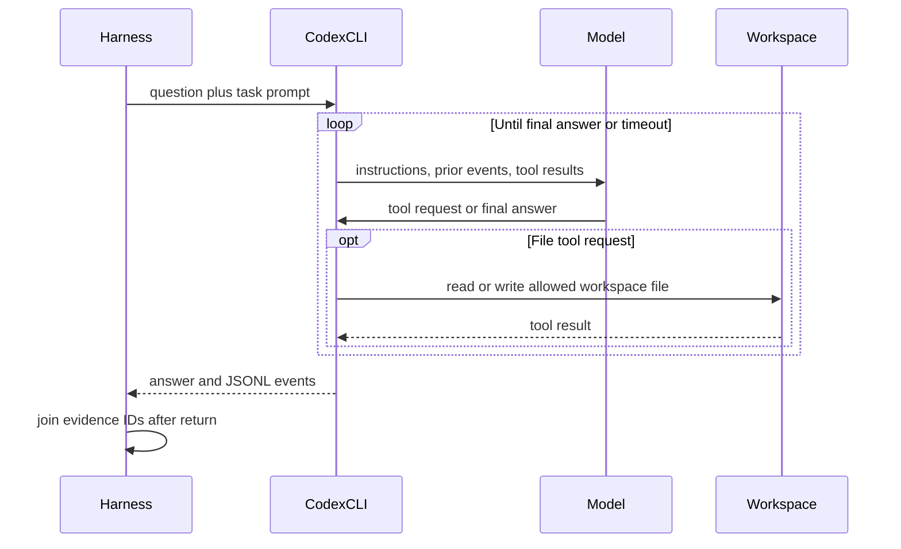
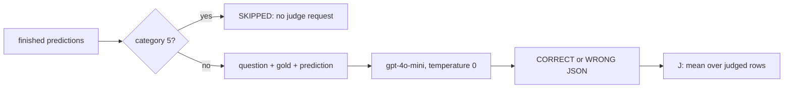

# Unrolling the Evaluation and Agent Loops

This is the audit guide for one long-term-memory result. It follows one
LoCoMo question from the released JSON to an answer, then through two
independent scoring protocols. The explanatory structure mirrors
[OpenAI's description of the Codex agent loop](https://openai.com/index/unrolling-the-codex-agent-loop/):
identify the prompt, identify each tool boundary, and record what enters the
next model call.

The central boundary is simple: the answerer may see conversation-derived
memory and the question, it must not see the gold answer or LoCoMo evidence
IDs. The string scorer and the later Mem0 judge may see gold.

## Protocols, repository code, and ownership

| Owner | Supplies | This repository does |
|---|---|---|
| LoCoMo (Maharana et al., 2024) | Dialogues, questions, gold answers, evidence IDs, and category-aware F1 rules | Loads the released `locomo10` subset without editing it, ports the released scorer rules |
| Mem0 (Chhikara et al., 2025) | The released judge prompt, JSON CORRECT/WRONG convention, and category-5 exclusion | Pins the judge prompt/code shape and implements local memory-method clones separately |
| Codex CLI | The model/tool/model loop after `codex exec` starts | Provides the workspace, disables web search, records raw/normalized events, and scores only the returned answer |
| This repository | Config composition, memory builders, reader invocation, pack artifacts, runner, and analysis | Does not own either benchmark or recreate paper-table numbers |

`mem0`, `mem0g`, `rag`, and `openai_memory` are local implementations of
published-method shapes. `graph` is this repository's single-writer graph
method, not Mem0g. Mem0 Table 1–2 values remain literature pins. A local
judge run, an OSS clone, or an agent run must not be called a paper result.

## The provenance path



A configuration matrix expands to **run specs**. Each run spec has a hashed
run ID and writes one `experiments/<run_id>/` pack. The experiment runner
schedules run specs, it does not answer or score questions itself.

## What LoCoMo data contain

`src/locomo_eval/dataset.py` parses `data/raw/locomo10.json`, pinned to
LoCoMo commit `3eb6f2c585f5e1699204e3c3bdf7adc5c28cb376`. It creates
`question_id` as `{sample_id}-q-{qa_index}` in source-array order.

| Source field | Model visibility | Scorer/audit use |
|---|---|---|
| `conversation.session_N` turns, dates, speakers, `dia_id` | May enter a memory string or agent workspace | Traceable source text |
| `session_summary` | Only dataset-summary `session_summaries` memory | Audit lineage |
| `observation` | Not injected by current builders or workspaces | Parsed only |
| `qa[].question` | Reader/agent task input | Stored in predictions |
| `qa[].answer` | Never reader/writer/workspace input | LoCoMo scorer and Mem0 judge |
| `qa[].evidence` | Never reader/writer/workspace input | Post-hoc agent-trajectory audit |

Questions run sequentially inside one run: source conversation order, then
`qa` array order. A capped subset is the deterministic file-order prefix and
is not a benchmark result. The runner parallelizes independent run specs, such
as one Cloud Run task per matrix entry, it does not parallelize questions
within a run.

## LLM call scheduling and reproducibility

This repository does not use provider batch APIs. One QA run is deliberately
single-threaded:

| Pipeline stage | Scheduling inside one run | Why it is serialized |
|---|---|---|
| Model-only reader | One Chat Completions request per question | Preserves source question order and makes one trace, usage record, and retry history per answer. |
| Writer summaries / graphs | One write request per session or write step | Later state may depend on earlier writes, calls are logged in write order. |
| Codex harness | One `codex exec` process per question | A persisted workspace and its notes can affect later questions in that conversation. |
| Mem0-style autorater | One judge request per stored prediction | Produces one fresh verdict/trace at a time, category 5 is skipped by the judge protocol. |

There is no hidden request fan-out or in-process concurrency. A reader's
`min_request_interval_s` is a spacing floor between its sequential live calls,
rate-limit retries remain attached to that one call.

The experiment runner can run **independent cells** in parallel. Locally,
`execute-qa` executes one matrix cell. On Cloud Run, one task executes one
cell, the deployment default permits up to eight concurrent tasks, while the
operator's `--tasks=N` sets how many cells are launched. Thus simultaneous
provider calls can reach `min(N, configured Cloud Run parallelism)`, but only
across independent cells - not within a cell.

This scheduling is an implementation control, not a LoCoMo or Mem0 scoring
rule. LoCoMo and the Mem0-style judge define data/scoring protocols, not API
batch size or worker count. Full benchmark scores are valid under this
execution because every condition evaluates the complete frozen dataset with
the same per-cell order. For persisted agents, serial execution is required:
parallel questions would create an undefined notes-write order and change the
condition.

## Cloud Run environment

Live jobs run as Docker containers on **Google Cloud Run Jobs**. Cloud Run
provides virtual CPU and memory, the deployment config does not request GPUs. 
The deployment scripts default to `us-central1`, but region, resource limits, 
and parallelism are environment overrides. Report the deployed revision rather
than treating these defaults as an immutable hardware claim.

| Job | Work unit | Default resources | Task timeout / retries | Parallelism |
|---|---|---:|---:|---:|
| `memorybench-qa` | One matrix cell per task | 1 vCPU, 4 GiB RAM | 12 h / 2 | 8 |
| `memorybench-autorater` | One finished QA cell per task | 1 vCPU, 4 GiB RAM | 12 h / 2 | 8 |
| `memorybench-aggregate` | One campaign aggregation | 1 vCPU, 4 GiB RAM | 12 h / 2 | 1 |
| `memorybench-collect-full` | One full-pack collection | 8 vCPU, 32 GiB RAM | 12 h / 2 | 1 |

At execution, `--tasks=N` selects the number of matrix cells in that wave.
The concurrent-task upper bound is `min(N, job parallelism)`. Each task owns
one `experiments/<experiment>/runs/<run_id>/` GCS prefix. Workers never append
to a shared Parquet file. QA must finish before the autorater wave, aggregation
and full-pack collection run afterward.

For paper reporting, record the following from the actual
deployment and pack, not only the repository defaults:

1. GCP region, Cloud Run job revision, task count, parallelism, vCPU, memory,
   timeout, and retry settings for every wave.
2. Container image digest (a short Git tag is convenient but not immutable),
   repository Git hash, Python/package lock or image build record.
3. Experiment YAML hash, expanded manifest/run IDs, LoCoMo data hash and pin,
   prompt hashes, model IDs/snapshots, and all reader/writer/judge controls.
4. GCS prefix layout plus the `_SUCCESS` markers proving completed QA and judge
   waves. Store run packs, traces, and generated tables/plots with the result.
5. The fact that API credentials were injected from Secret Manager and were
   not stored in the image, config, logs, or archived run pack.

The deployment scripts are `scripts/deploy_gcp.ps1` and
`scripts/deploy_gcp.sh`, `infra/gcp/README.md` defines the resource layout.
Before reporting results, export the active job definitions, for example:

```bash
gcloud run jobs describe memorybench-qa --region="$REGION" --format=yaml
gcloud run jobs describe memorybench-autorater --region="$REGION" --format=yaml
gcloud run jobs describe memorybench-aggregate --region="$REGION" --format=yaml
gcloud run jobs describe memorybench-collect-full --region="$REGION" --format=yaml
```

## Three answer paths



### 1. Stuffed reader

`raw_chunks`, dataset `session_summaries`, and `full_context` form
`Memory.text` in Python. The reader gets `{memory}` and `{question}` through
the configured answer prompt, then produces one Chat Completions response at
the reader's configured temperature. No read-path tools run.

### 2. Writer then frozen reader

With `writer.model`, `session_summaries` makes one writer call per session.
`graph` makes entity/relation JSON per session, then software writes the
locked local graph representation. The answer reader is unchanged. This
isolates a writer-model change from a reader-model change.

`mem0`, `mem0g`, `rag`, and `openai_memory` instead use a separately built
index. QA reads that index, it does not re-extract facts. Their write prompts
and storage are local clones, not the Mem0 Platform.

### 3. Agent harness

`workspace_files` writes `INDEX.md` and `sessions/session_N.md` without an
LLM. Turns retain `dia_id`, gold answers and evidence IDs are absent.
`Memory.text` is only a workspace manifest, not the transcript.

For each question, Python starts one `codex exec` and waits. Codex then owns
the inner loop:



The adapter disables hosted web search, ignores user config/rules, and uses a
read-only sandbox unless persistence is enabled. Persist-on notes survive only
within the same conversation workspace. `notes_only` performs an ingest pass,
hides `sessions/`, and leaves notes as the only permitted source.

Native Codex cannot enforce common per-tool-call or retrieved-token budgets.
It is therefore audit-only unless the recorded `agent_comparison.v1` status is
`comparable`. A `tools: controlled` label alone is not an enforcement claim.

## LoCoMo scoring: the benchmark score

The QA process scores the returned string with
`src/metrics/locomo_qa.py`, a close port of LoCoMo's released
`task_eval/evaluation.py`. This happens without another model call.

| JSON category | Type | LoCoMo rule |
|---:|---|---|
| 4 | single-hop | Porter-stemmed token F1 |
| 1 | multi-hop | Split prediction and gold on commas, average each gold item's best prediction F1 |
| 2 | temporal | Porter-stemmed token F1 |
| 3 | open-domain | Score only the gold text before the first `;` |
| 5 | adversarial | 1 only for “not mentioned” or “no information available” |

Repository-only exact match and token F1 are also computed, but they are not
LoCoMo paper metrics. LoCoMo F1 in a QA pack includes category 5. Campaign
overalls may intentionally drop it when aligned to the Mem0 judged subset,
category tables retain it.

`predictions.jsonl` is the unscored QA audit stream: question, gold,
prediction, memory metadata, and agent fields. Per-row string scores are in
`predictions.csv`, `metrics.json`, and later aggregate Parquet. Run
`python -m src.locomo_eval.offline_evaluate` to deterministically rescore a
stored prediction file.

## Mem0 evaluation: a second protocol on the same answer

The Mem0 judge does not change the answer pipeline. It runs later, over the
already stored `predicted_answer`.



`prompts/autoraters/autorater_mem0_v1.txt` is pinned from Mem0's released
`ACCURACY_PROMPT` at commit `ece7ff6b`. The local judge uses the released
shape: `gpt-4o-mini`, temperature zero, JSON label output, and category 5
skip. It sees the question, gold answer, and prediction by design. Its
`llm_score=0` placeholder for a skipped row is excluded from the J
denominator.

Mem0 lexical F1 and BLEU-1 are separate autorater-pack metrics. They use the
local Mem0-style tokenization and should not be confused with LoCoMo F1.
The paper reported ten independent judge runs with mean ± standard deviation,
the default local job is one judge pass. Use multiple seed packs and
`scripts.analysis.aggregate_seeds` when that aggregation is required.

## Audit one result end to end

| Question | Inspect |
|---|---|
| What actually ran? | `config.resolved.yaml`, `run_meta.json`, `prompts/`, `TRACE.md` |
| What did a stuffed reader receive? | `memory/`, `predictions.jsonl`, `reader/traces.jsonl` |
| What did a writer see and produce? | `memory/writer/sessions/`, `memory/writer/calls.jsonl`, `memory/lineage.jsonl`, `memory/graph/` |
| What did Codex read/write? | `agent/workspaces/`, `agent/events.jsonl`, `agent/trajectory.jsonl`, `agent/COMPARISON.md` |
| How was LoCoMo F1 made? | `predictions.csv`, `metrics.json`, `src/metrics/locomo_qa.py` |
| How was J made? | `autorater/autorater_verdicts.jsonl`, `autorater/traces.jsonl`, `autorater/autorater_metrics.json` |
| How did a table get its number? | `examples.parquet` → run pack → trace |

Evidence IDs are joined to agent trajectory text after Codex returns:
`memory_recall` is the fraction of gold `dia_id`s found in retrieved text,
and `hop_to_evidence` is the first retrieve step that hits one. They are
diagnostics, never model inputs.

## Contamination controls and their scope

For a live result, verify all of the following:

1. The reader template has `{memory}` and `{question}`, never a gold slot.
2. Writer prompts receive session text, not questions, gold answers, or
   evidence IDs.
3. Workspaces contain conversation turns and agent-written notes only.
4. Observations are not copied into the current memory/workspace paths.
5. LoCoMo string scoring and the Mem0 judge are the only intended stages that
   receive `Question.answer`.
6. Shared indexes are built from conversations, not question gold.
7. Category 5 remains present in LoCoMo F1 and absent from J.

`verify_pack` is useful but narrow: it detects sufficiently long gold strings
in dumped `memory_text`, it does not prove that every reader trace or agent
workspace is gold-free. Audit those files directly, and rely on the
reader/workspace regression tests for their construction contracts. A mock
reader or mock judge is plumbing, never a scientific result.

## What does not create new answers

After QA, `execute-autorater` is the only normal stage that makes more model
calls. `aggregate`, `collect-full`, `report`, comparison scripts, and thin
notebooks read finished artifacts. A reported number should be walkable from
a table row to `examples.parquet`, then to the run pack and its reader or
agent trace.
