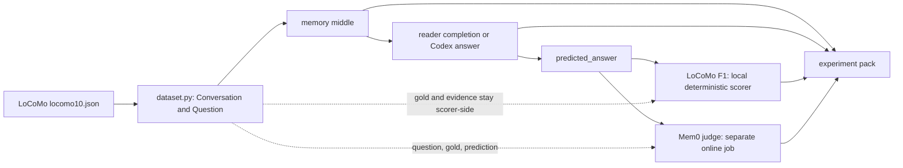
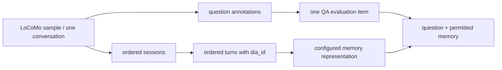
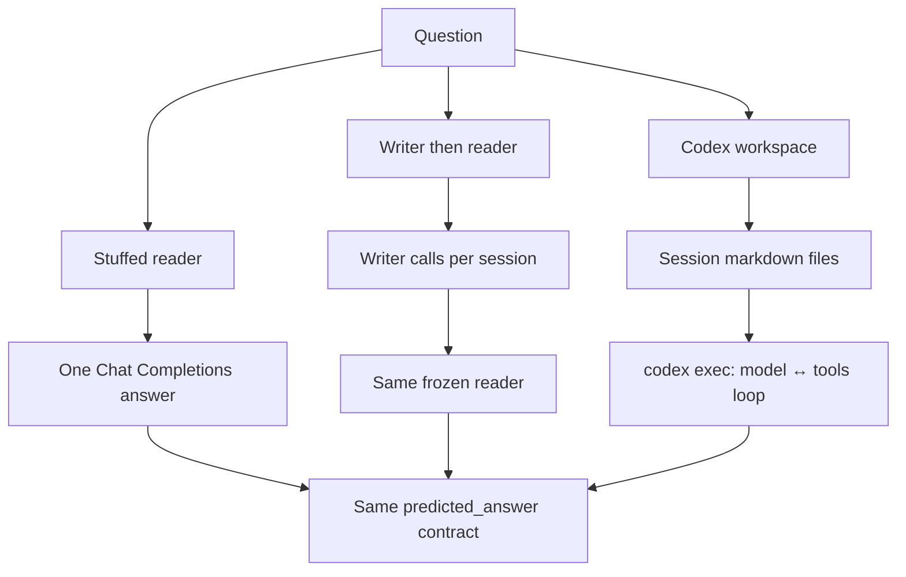
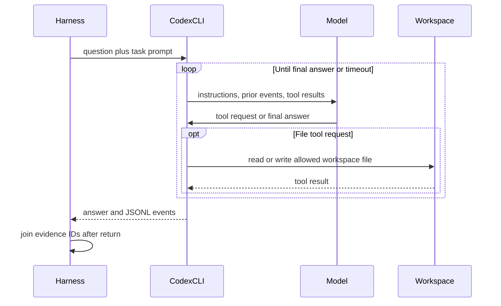
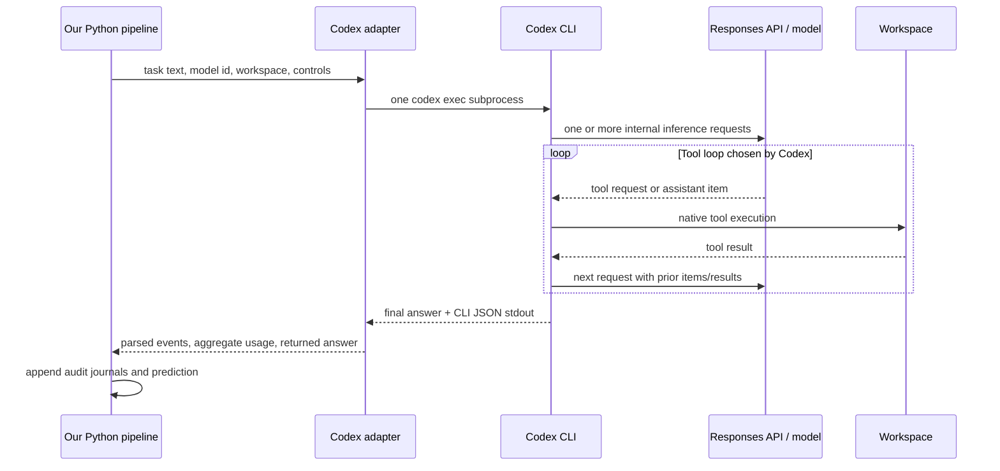
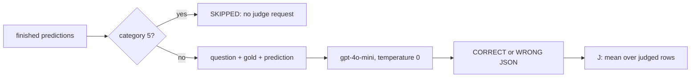

# Unrolling the Evaluation and Agent Loops

This is the audit guide for one long-term-memory result. It follows one
LoCoMo question from the released JSON to an answer, then through two
independent scoring protocols. The explanatory structure mirrors
[OpenAI's description of the Codex agent loop](https://openai.com/index/unrolling-the-codex-agent-loop/):
identify the prompt, identify each tool boundary, and record what enters the
next model call.

The central boundary is simple: the answerer may see conversation-derived
memory and the question, it must not see the gold answer or LoCoMo evidence
IDs. The string scorer and the later Mem0 judge may see gold.

## Protocols, repository code, and ownership

| Owner | Supplies | This repository does |
|---|---|---|
| LoCoMo (Maharana et al., 2024) | Dialogues, questions, gold answers, evidence IDs, and category-aware F1 rules | Loads the released `locomo10` subset without editing it, ports the released scorer rules |
| Mem0 (Chhikara et al., 2025) | The released judge prompt, JSON CORRECT/WRONG convention, and category-5 exclusion | Pins the judge prompt/code shape and implements local memory-method clones separately |
| Codex CLI | The model/tool/model loop after `codex exec` starts | Provides the workspace, disables web search, records raw/normalized events, and scores only the returned answer |
| This repository | Config composition, memory builders, reader invocation, pack artifacts, runner, and analysis | Does not own either benchmark or recreate paper-table numbers |

`mem0`, `mem0g`, `rag`, and `openai_memory` are local implementations of
published-method shapes. `graph` is this repository's single-writer graph
method, not Mem0g. Mem0 Table 1–2 values remain literature pins. A local
judge run, an OSS clone, or an agent run must not be called a paper result.

## The provenance path



A configuration matrix expands to **run specs**. Each run spec has a hashed
run ID and writes one `experiments/<run_id>/` pack. The experiment runner
schedules run specs, it does not answer or score questions itself.

## What LoCoMo data contain

`src/locomo_eval/dataset.py` parses `data/raw/locomo10.json`, pinned to
LoCoMo commit `3eb6f2c585f5e1699204e3c3bdf7adc5c28cb376`. It creates
`question_id` as `{sample_id}-q-{qa_index}` in source-array order.

| Source field | Model visibility | Scorer/audit use |
|---|---|---|
| `conversation.session_N` turns, dates, speakers, `dia_id` | May enter a memory string or agent workspace | Traceable source text |
| `session_summary` | Only dataset-summary `session_summaries` memory | Audit lineage |
| `observation` | Not injected by current builders or workspaces | Parsed only |
| `qa[].question` | Reader/agent task input | Stored in predictions |
| `qa[].answer` | Never reader/writer/workspace input | LoCoMo scorer and Mem0 judge |
| `qa[].evidence` | Never reader/writer/workspace input | Post-hoc agent-trajectory audit |

Questions run sequentially inside one run: source conversation order, then
`qa` array order. A capped subset is the deterministic file-order prefix and
is not a benchmark result. The runner parallelizes independent run specs, such
as one Cloud Run task per matrix entry, it does not parallelize questions
within a run.

### Dataset grain and what is replayed

The benchmark iteration unit is one **QA item**:
`(sample_id, qa_index, question, gold answer, category, evidence IDs)`.
Its context source is its parent **conversation sample**, which contains
chronologically numbered sessions, and each session contains ordered dialogue
turns. A conversation's QA records are not continuations of a live chat:
the released benchmark evaluates each question against the completed static
conversation.



[LoCoMo's authors](https://aclanthology.org/2024.acl-long.747/) generated the
underlying long conversations with LLM agents,
personas, temporal event graphs, and multi-session interaction, then had human
annotators filter and edit them for consistency. This repository does **not**
replay that generation process. It loads the released static records and runs
the QA task. Its `session_summary` field is released generated dataset text;
using it here is an input-representation condition, not a rerun of LoCoMo's
original summarizer or RAG system. The LoCoMo paper's five QA categories are
single-hop, multi-hop, temporal, open-domain, and adversarial.

For ordinary model-only methods, QA items are independent despite being
executed in source order. Persisted Codex is deliberately different: its notes
can carry state between questions within a conversation workspace. That is a
repository agent-harness condition, not part of the original LoCoMo QA
protocol, and its note ledger makes the difference auditable.

### Exactly what `full_context` and dataset `session_summaries` contain

Neither reader receives the raw JSON object verbatim. `full_context` is a
formatted rendering of **all dialogue turns** under `conversation`; dataset
`session_summaries` is a formatted concatenation of the released
`session_summary` strings. Both are supplied as `{memory}` in the same reader
template, followed by the same QA question.

This deliberately truncated source record illustrates the distinction:

```json
{
  "sample_id": "conv-example",
  "conversation": {
    "speaker_a": "Alice",
    "speaker_b": "Bob",
    "session_1_date_time": "2023-01-10",
    "session_1": [
      {"dia_id": "D1:1", "speaker": "Alice", "text": "I started pottery."},
      {"dia_id": "D1:2", "speaker": "Bob", "text": "That sounds relaxing."}
    ],
    "session_2_date_time": "2023-03-03",
    "session_2": [
      {"dia_id": "D2:1", "speaker": "Alice", "text": "I made a blue bowl."}
    ]
  },
  "session_summary": {
    "session_1_summary": "Alice began pottery; Bob encouraged her.",
    "session_2_summary": "Alice made a blue bowl."
  },
  "qa": [{
    "question": "What color was Alice's bowl?",
    "answer": "blue",
    "category": 4,
    "evidence": ["D2:1"]
  }]
}
```

For this record, the two reader-visible `{memory}` values are:

| Condition | Exact representation shape | Not included |
|---|---|---|
| `full_context` | `2023-01-10 \| Alice: I started pottery.`<br>`2023-01-10 \| Bob: That sounds relaxing.`<br>`2023-03-03 \| Alice: I made a blue bowl.` | `qa`, gold answer, evidence IDs, observations, and the `session_summary` strings |
| Dataset `session_summaries` | `[Session 1]`<br>`Alice began pottery; Bob encouraged her.`<br><br>`[Session 2]`<br>`Alice made a blue bowl.` | Raw dialogue turns, `qa`, gold answer, evidence IDs, and observations |

The reader prompt has instructions before this material; its decisive tail is:

```text
Memories:

<one representation from the table above>

Question: What color was Alice's bowl?
Answer:
```

Thus full context means “every released conversation turn, formatted as
timestamp/speaker/text,” not “every field in the LoCoMo JSON” and not a filled
model context window. Dataset summaries mean “all released per-session summary
fields in chronological order,” not summary retrieval and not raw turns plus
summaries together.

`session_summaries` is overloaded by design in the broader codebase. With no
`writer.model`, as in the reader comparison, it means the LoCoMo
`session_summary` field shown above. With a `writer.model`, the same memory ID
instead means summaries newly produced by that configured writer from session
turns. Run metadata, writer traces, and `writer_model` distinguish those two
conditions; they must not be pooled in a claim.

### What happens during one QA item

The answer loop is not “answer → F1 → full audit → next question.” Its actual
ordering keeps gold outside the answer call and avoids repeatedly rewriting
large artifacts:

```mermaid
sequenceDiagram
  participant D as Released LoCoMo record
  participant P as QA pipeline
  participant A as Answerer
  participant J as QA JSONL journal
  D->>P: conversation + question; gold stays local
  P->>P: build/retrieve permitted memory
  P->>A: prompt or Codex task, never gold/evidence IDs
  A-->>P: predicted answer + emitted metadata
  P->>J: append prediction row immediately
  opt Agent harness
    P->>J: append raw events, trace, trajectory, note snapshot
  end
  Note over P: After all QA items: deterministic F1, reports, final audit modules
```

For question-independent memory (`full_context`, dataset summaries, and some
write methods), the representation is built once per conversation before its
questions are answered. Question-dependent retrieval builds memory in the
relevant QA iteration. `predictions.jsonl` is append-only during QA so a failed
run preserves completed answers. The complete reader trace module, memory
dump, CSV, metrics, plots, lineage, and final agent roll-up are finalized after
the QA loop (or written partially on failure).

LoCoMo F1 is therefore not an online control signal to the answerer. It is
computed deterministically from stored prediction/gold pairs after QA; it
never changes the next prompt. Gold answers are present in the local prediction
record solely for later scoring and are never injected into reader, writer, or
workspace inputs.

## LLM call scheduling and reproducibility

This repository does not use provider batch APIs. One QA run is deliberately
single-threaded:

| Pipeline stage | Scheduling inside one run | Why it is serialized |
|---|---|---|
| Model-only reader | One Chat Completions request per question | Preserves source question order and makes one trace, usage record, and retry history per answer. |
| Writer summaries / graphs | One write request per session or write step | Later state may depend on earlier writes, calls are logged in write order. |
| Codex harness | One `codex exec` process per question | A persisted workspace and its notes can affect later questions in that conversation. |
| Mem0-style autorater | One judge request per stored prediction | Produces one fresh verdict/trace at a time, category 5 is skipped by the judge protocol. |

There is no hidden request fan-out or in-process concurrency. A reader's
`min_request_interval_s` is a spacing floor between its sequential live calls,
rate-limit retries remain attached to that one call.

The experiment runner can run **independent cells** in parallel. Locally,
`execute-qa` executes one matrix cell. On Cloud Run, one task executes one
cell, the deployment default permits up to eight concurrent tasks, while the
operator's `--tasks=N` sets how many cells are launched. Thus simultaneous
provider calls can reach `min(N, configured Cloud Run parallelism)`, but only
across independent cells - not within a cell.

This scheduling is an implementation control, not a LoCoMo or Mem0 scoring
rule. LoCoMo and the Mem0-style judge define data/scoring protocols, not API
batch size or worker count. Full benchmark scores are valid under this
execution because every condition evaluates the complete frozen dataset with
the same per-cell order. For persisted agents, serial execution is required:
parallel questions would create an undefined notes-write order and change the
condition.

## Cloud Run environment

Live jobs run as Docker containers on **Google Cloud Run Jobs**. Cloud Run
provides virtual CPU and memory, the deployment config does not request GPUs. 
The deployment scripts default to `us-central1`, but region, resource limits, 
and parallelism are environment overrides. Report the deployed revision rather
than treating these defaults as an immutable hardware claim.

| Job | Work unit | Default resources | Task timeout / retries | Parallelism |
|---|---|---:|---:|---:|
| `memorybench-qa` | One matrix cell per task | 1 vCPU, 4 GiB RAM | 12 h / 2 | 8 |
| `memorybench-autorater` | One finished QA cell per task | 1 vCPU, 4 GiB RAM | 12 h / 2 | 8 |
| `memorybench-aggregate` | One campaign aggregation | 1 vCPU, 4 GiB RAM | 12 h / 2 | 1 |
| `memorybench-collect-full` | One full-pack collection | 8 vCPU, 32 GiB RAM | 12 h / 2 | 1 |

`JOB_MEMORY`, `JOB_CPU`, and `JOB_PARALLELISM` are deployment-time overrides
for QA and autorater. Aggregate separately defaults to `AGGREGATE_MEMORY=4Gi`
and `AGGREGATE_CPU=1`, because Cloud Run limits a 1-vCPU container to 4 GiB.
For a memory-heavy cell, deploy QA and autorater with `8Gi`, `2`, and `3`,
respectively: that permits at most three 8-GiB tasks while preserving the
sequential question loop inside each task. `--tasks=N` selects cell indices
`0` through `N - 1`; it does not alter the job's deployed parallelism.

At execution, `--tasks=N` selects the number of matrix cells in that wave.
The concurrent-task upper bound is `min(N, job parallelism)`. Each task owns
one `experiments/<experiment>/runs/<run_id>/` GCS prefix. Workers never append
to a shared Parquet file. QA must finish before the autorater wave, aggregation
and full-pack collection run afterward.

For paper reporting, record the following from the actual
deployment and pack, not only the repository defaults:

1. GCP region, Cloud Run job revision, task count, parallelism, vCPU, memory,
   timeout, and retry settings for every wave.
2. Container image digest (a short Git tag is convenient but not immutable),
   repository Git hash, Python/package lock or image build record.
3. Experiment YAML hash, expanded manifest/run IDs, LoCoMo data hash and pin,
   prompt hashes, model IDs/snapshots, and all reader/writer/judge controls.
4. GCS prefix layout plus the `_SUCCESS` markers proving completed QA and judge
   waves. Store run packs, traces, and generated tables/plots with the result.
5. The fact that API credentials were injected from Secret Manager and were
   not stored in the image, config, logs, or archived run pack.

The deployment scripts are `scripts/deploy_gcp.ps1` and
`scripts/deploy_gcp.sh`, `infra/gcp/README.md` defines the resource layout.
Before reporting results, export the active job definitions, for example:

```bash
gcloud run jobs describe memorybench-qa --region="$REGION" --format=yaml
gcloud run jobs describe memorybench-autorater --region="$REGION" --format=yaml
gcloud run jobs describe memorybench-aggregate --region="$REGION" --format=yaml
gcloud run jobs describe memorybench-collect-full --region="$REGION" --format=yaml
```

## Three answer paths



### 1. Stuffed reader

`raw_chunks`, dataset `session_summaries`, and `full_context` form
`Memory.text` in Python. The reader gets `{memory}` and `{question}` through
the configured answer prompt, then produces one Chat Completions response at
the reader's configured temperature. No read-path tools run.

### 2. Writer then frozen reader

With `writer.model`, `session_summaries` makes one writer call per session.
`graph` makes entity/relation JSON per session, then software writes the
locked local graph representation. The answer reader is unchanged. This
isolates a writer-model change from a reader-model change.

`mem0`, `mem0g`, `rag`, and `openai_memory` instead use a separately built
index. QA reads that index, it does not re-extract facts. Their write prompts
and storage are local clones, not the Mem0 Platform.

This separates two meanings often conflated as “the Mem0 protocol.” The Mem0
paper describes a memory architecture that ingests conversational updates,
extracts/updates retrievable memory, and evaluates answers on LoCoMo; it also
uses an LLM-as-a-judge metric. In this repository, a `mem0` or `mem0g` run is
one local write/retrieve implementation used to produce an answer context,
while the Mem0-style judge is a later, independent scoring stage. Choosing the
judge does not turn a full-context, RAG, Codex, or summary condition into a
Mem0 memory system.

### 3. Agent harness

`workspace_files` writes `INDEX.md` and `sessions/session_N.md` without an
LLM. Turns retain `dia_id`, gold answers and evidence IDs are absent.
`Memory.text` is only a workspace manifest, not the transcript.

For each question, Python starts one `codex exec` and waits. Codex then owns
the inner loop:



Python supplies the task text once to `codex exec`; it does not itself resend
the question for every file operation. Internally, Codex constructs its first
model request from its system/developer instructions, enabled tool schemas, and
that task text. When the model asks for a tool, Codex executes it and adds the
tool call/result to the conversation items used by the next model inference.
The effective model context therefore grows and changes within a single
question, exactly as described in
[OpenAI's Codex loop explanation](https://openai.com/index/unrolling-the-codex-agent-loop/).
It ends only when Codex emits a final answer or reaches an execution limit.

### What the harness controls, and what it cannot guarantee

| Property | Model-only reader | Codex harness |
|---|---|---|
| Outer unit we start | One direct Chat Completions API request | One `codex exec` task process |
| Model inferences for one QA item | Exactly one answer request | CLI-controlled: zero or more model/tool iterations before a final answer |
| Prompt evolution | Fixed rendered reader prompt for that request | Initial task plus Codex system/developer instructions, tool schemas, prior tool calls, and tool results |
| Tool execution | None | Native local workspace tools allowed; hosted web search disabled; user MCP/config ignored |
| Stop control | Reader request timeout/retries | Outer harness timeout; Codex decides when its internal loop is complete |

We control the outer Codex invocation, its model name, working directory,
read-only versus workspace-write sandbox, timeout, and no-web/no-user-MCP
flags. We do **not** control or promise a fixed number of internal inference
calls, a fixed number of native tool calls, whether the CLI batches or
parallelizes internal work, or the exact hidden prompt representation used by
the Responses API. Native Codex cannot enforce this repository's generic
tool-call or retrieved-token budget. Those are why its strict comparison
status is normally `incomparable`.

The audit is observation, not a guarantee about un-emitted internal behavior:
`agent/events.jsonl` retains CLI-emitted JSON events; `agent/trajectory.jsonl`
normalizes observed reads/writes/search/MCP events; and `agent/traces.jsonl`
retains the returned answer plus CLI-emitted usage/reasoning fields when
available. These can show observed workspace reads, note writes, web/MCP
leakage, usage totals, and emitted reasoning items. They cannot prove the
number of hidden model calls, rule out un-emitted duplicate calls, or reveal
private chain-of-thought.

### Codex ownership and observation boundary



Our pipeline owns the first row of controls: task text, `--model`, working
directory, sandbox choice, outer timeout, and the flags disabling hosted web
search and user MCP/config. The **Codex CLI** owns Responses API request
construction, retries, context growth/compaction, tool scheduling, and its
stdout event schema. The **model/API** owns inference and token accounting.
Passing a model name to `codex exec` selects the model for the CLI; it does not
give this repository an OpenAI client object, request IDs, or a callback for
each internal inference.

| Observation layer | What the current pack can establish | What it cannot establish |
|---|---|---|
| Adapter argv + `run_meta.json` | Outer process, requested model, sandbox, timeout, task/payload hashes | The exact Responses request payload after Codex adds hidden instructions/history |
| `agent/events.jsonl` | CLI-emitted tool/activity items | A complete per-HTTP-request transcript or every retry/continuation |
| `turn.completed.usage` when emitted | One CLI-reported aggregate usage object for the outer Codex turn | Token and cost attribution for each internal inference/tool iteration |
| Workspace + notes snapshots | Files and persisted notes observable after the task | In-memory context that was never written or emitted |
| Provider billing/usage console | Account/project/model/time-window totals when the account exposes them | Automatic join to this `run_id`, question, or Codex task; an exact event-level audit |

To obtain request-level model-side counts, a future experiment would need a
purpose-built, privacy-reviewed Responses API proxy or a pinned/instrumented
Codex build that logs a correlation ID, request count, and per-request usage.
That is not part of the current protocol. A proxy must be designed carefully:
it can capture full conversation-derived prompts and tool outputs, so it
creates a new sensitive audit artifact and must not be treated as harmless
telemetry.

### Parallel Cloud Run tasks: isolation is not dashboard attribution

Using the same API key for parallel Cloud Run tasks does **not** merge their
Codex conversations, workspaces, notes, or experiment packs. Each Cloud Run
task is a separate container process; each task owns one run ID and one GCS
run prefix; and Codex starts a separate outer process for every QA item. Codex
does not receive another task's workspace path, notes, task text, or emitted
events. Shared credentials authenticate requests to the same provider account;
they are not a shared memory store.

The shared-key effects are operational rather than data contamination:

| Shared component | Effect | Scientific interpretation |
|---|---|---|
| OpenAI account/project usage | Dashboard totals from concurrent tasks are interleaved | Weak per-run attribution, not prompt/context leakage |
| Rate and spend limits | Parallel calls can contend, causing retries, delay, or failure | Record latency/retry failures; do not call it a memory-method effect |
| Model service | Requests are separate API requests; provider caching may affect cost/latency | No task-to-task workspace or conversation state is supplied by this harness |
| GCS bucket | Tasks use distinct `runs/<run_id>/` prefixes | No shared result-file append or pack overwrite |

When `CODEX_API_KEY` is absent, this harness passes `OPENAI_API_KEY` to Codex.
An API-key-backed Codex run can therefore be checked in the OpenAI
account/project usage dashboard by model and time window, subject to the
account's dashboard permissions and aggregation. The dashboard is useful for
reconciling an isolated single-task test or a whole campaign window. It cannot
automatically join usage to this repository's `run_id` or `question_id`; with
parallel tasks using the same key, it cannot assign a dashboard total to one
cell without an additional correlation mechanism. A saved Codex/ChatGPT login
may follow a different accounting path and should be recorded separately.

Codex is open source, so a stronger future audit is feasible: pin a Codex
revision, add a minimal request-boundary event containing a repository run ID,
question ID, timestamp, response/request ID, model, and per-request usage,
then build that binary into the Cloud Run image. The event should contain
hashes/lengths rather than raw prompts, tool output, or private reasoning.
That would count client-side Responses API requests and associate them with
run-pack artifacts. It would still not expose server-private inference steps,
and it changes the executable under evaluation; record the fork commit,
build digest, and verify that the instrumentation does not change tool or
answer behavior.

This means `workspace_files` is not a stuffed-prompt experiment: the task
prompt names the question, while the model chooses whether and how to read
workspace files. The matched-reader-payload mode is different: the rendered
LoCoMo reader payload is supplied directly as Codex's initial task. Its
persist-on variant appends a small Codex-only instruction to read/write notes,
so its task hash differs even though `reader_payload_sha256` proves the shared
LoCoMo evidence payload.

The adapter disables hosted web search, ignores user config/rules, and uses a
read-only sandbox unless persistence is enabled. Persist-on notes survive only
within the same conversation workspace. `notes_only` performs an ingest pass,
hides `sessions/`, and leaves notes as the only permitted source.

Native Codex cannot enforce common per-tool-call or retrieved-token budgets.
It is therefore audit-only unless the recorded `agent_comparison.v1` status is
`comparable`. A `tools: controlled` label alone is not an enforcement claim.

### 4. Codex with a matched reader payload

The mini/Codex reader analysis is a separate harness mode. It renders
`qa_mem0_v1` with the same `{memory}` and `{question}` bytes supplied to the
one-shot model, records `reader_payload_sha256`, and passes that payload to
Codex directly. Its workspace contains no conversation files, so a workspace
read is neither expected nor counted as retrieval.

Persist-off receives only the shared reader payload. Persist-on adds a small
Codex-only instruction after that payload to read and append
`memory/notes.md`; `agent_task_sha256` records the resulting final task
separately. Notes are therefore an explicit stateful-agent variable, not a
claim that the model-only request was identical end to end.

`prompt_injected` labels this evidence-delivery mode in agent metrics. It
means the memory representation was supplied in the task prompt, so absent
workspace reads must not become `retrieval_failure`. Workspace retrieval,
evidence recall, and hop metrics remain reserved for `workspace_files`.

Long agent runs append raw events, traces, trajectories, prediction rows, and
note-ledger rows as JSONL journals. For `full_context`, claim lineage records
one injected conversation payload per question rather than duplicating every
turn for every answer. This keeps the pack auditable without turning a
full-context run into a quadratic in-memory audit.

The Codex subprocess output is captured until that question finishes, then its
CLI-emitted JSON events are parsed and appended to `agent/events.jsonl`, with a
normalized `agent/trajectory.jsonl` and one `agent/traces.jsonl` row. This is
per-question persistence to disk, not a live network stream from the CLI.
It preserves CLI-emitted reasoning/usage fields when available, but cannot
recover private chain-of-thought or tool/model context that Codex does not
emit.

## LoCoMo scoring: the benchmark score

The QA process scores the returned string with
`src/metrics/locomo_qa.py`, a close port of LoCoMo's released
`task_eval/evaluation.py`. This happens without another model call.

| JSON category | Type | LoCoMo rule |
|---:|---|---|
| 4 | single-hop | Porter-stemmed token F1 |
| 1 | multi-hop | Split prediction and gold on commas, average each gold item's best prediction F1 |
| 2 | temporal | Porter-stemmed token F1 |
| 3 | open-domain | Score only the gold text before the first `;` |
| 5 | adversarial | 1 only for “not mentioned” or “no information available” |

Repository-only exact match and token F1 are also computed, but they are not
LoCoMo paper metrics. LoCoMo F1 in a QA pack includes category 5. Campaign
overalls may intentionally drop it when aligned to the Mem0 judged subset,
category tables retain it.

`predictions.jsonl` is the unscored QA audit stream: question, gold,
prediction, memory metadata, and agent fields. Per-row string scores are in
`predictions.csv`, `metrics.json`, and later aggregate Parquet. Run
`python -m src.locomo_eval.offline_evaluate` to deterministically rescore a
stored prediction file.

## Mem0 evaluation: a second protocol on the same answer

The Mem0 judge does not change the answer pipeline. It runs later, over the
already stored `predicted_answer`.



`prompts/autoraters/autorater_mem0_v1.txt` is pinned from Mem0's released
`ACCURACY_PROMPT` at commit `ece7ff6b`. The local judge uses the released
shape: `gpt-4o-mini`, temperature zero, JSON label output, and category 5
skip. It sees the question, gold answer, and prediction by design. Its
`llm_score=0` placeholder for a skipped row is excluded from the J
denominator.

The judge wave starts from the stored QA rows in their saved order. For every
non-adversarial row it makes one fresh judge call with only the question, gold
answer, and generated answer; it does not rerun the reader, Codex, retrieval,
or memory writer. It appends verdicts/traces as it proceeds, then computes J
from the completed verdict file. This is why a judge failure can be rerun
without spending answer-model calls and why it cannot influence later QA
answers.

Mem0 lexical F1 and BLEU-1 are separate autorater-pack metrics. They use the
local Mem0-style tokenization and should not be confused with LoCoMo F1.
The paper reported ten independent judge runs with mean ± standard deviation,
the default local job is one judge pass. Use multiple seed packs and
`scripts.analysis.aggregate_seeds` when that aggregation is required.

## Audit one result end to end

| Question | Inspect |
|---|---|
| What actually ran? | `config.resolved.yaml`, `run_meta.json`, `prompts/`, `TRACE.md` |
| What did a stuffed reader receive? | `memory/`, `predictions.jsonl`, `reader/traces.jsonl` |
| What did a writer see and produce? | `memory/writer/sessions/`, `memory/writer/calls.jsonl`, `memory/lineage.jsonl`, `memory/graph/` |
| What did Codex read/write? | `agent/workspaces/`, `agent/events.jsonl`, `agent/trajectory.jsonl`, `agent/COMPARISON.md` |
| How was LoCoMo F1 made? | `predictions.csv`, `metrics.json`, `src/metrics/locomo_qa.py` |
| How was J made? | `autorater/autorater_verdicts.jsonl`, `autorater/traces.jsonl`, `autorater/autorater_metrics.json` |
| How did a table get its number? | `examples.parquet` → run pack → trace |

Evidence IDs are joined to agent trajectory text after Codex returns:
`memory_recall` is the fraction of gold `dia_id`s found in retrieved text,
and `hop_to_evidence` is the first retrieve step that hits one. They are
diagnostics, never model inputs.

## Contamination controls and their scope

For a live result, verify all of the following:

1. The reader template has `{memory}` and `{question}`, never a gold slot.
2. Writer prompts receive session text, not questions, gold answers, or
   evidence IDs.
3. Workspaces contain conversation turns and agent-written notes only.
4. Observations are not copied into the current memory/workspace paths.
5. LoCoMo string scoring and the Mem0 judge are the only intended stages that
   receive `Question.answer`.
6. Shared indexes are built from conversations, not question gold.
7. Category 5 remains present in LoCoMo F1 and absent from J.

`verify_pack` is useful but narrow: it detects sufficiently long gold strings
in dumped `memory_text`, it does not prove that every reader trace or agent
workspace is gold-free. Audit those files directly, and rely on the
reader/workspace regression tests for their construction contracts. A mock
reader or mock judge is plumbing, never a scientific result.

## What does not create new answers

After QA, `execute-autorater` is the only normal stage that makes more model
calls. `aggregate`, `collect-full`, `report`, comparison scripts, and thin
notebooks read finished artifacts. A reported number should be walkable from
a table row to `examples.parquet`, then to the run pack and its reader or
agent trace.
